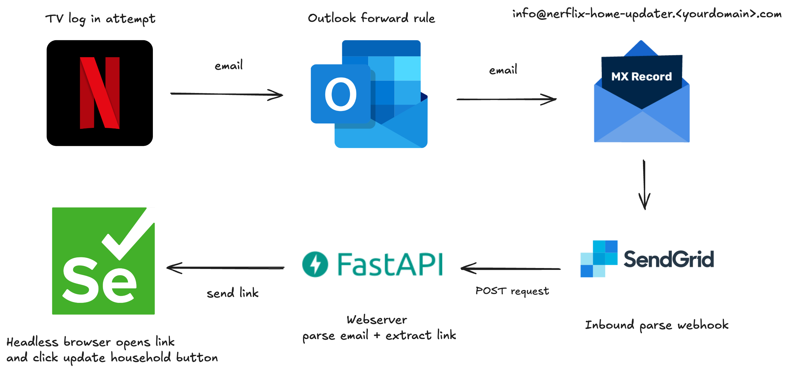

## Components
- Outlook forward rule (or any mail that allows to creates forward rules using recipient and subjects)
- Domain and ability to create MX record for it
- Sendgrid account using Inbound parse webhook
- FastAPI webserver listening for POST requests
- Selenium parsing HTML and clicking on Netflix button
- Selenium standalone-chromium container

## Contributors:
- [@julio-jg](https://github.com/juliojg)

## Install with docker

```bash
docker compose build
docker compuse up -d

```

Compose uses 2 containers, one with webserver and second one with standalone selenium.
We decided on this because selenium does not have a lot of support in ARM64 architectures using the local browser inside the same webserver.
More info here: https://github.com/SeleniumHQ/docker-selenium#browser-images-in-multi-arch

## Local development

```bash
uv init .
uv pip install
```
